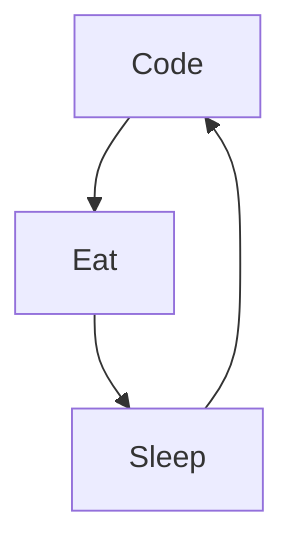

<h1 align="center">Bonjour les coders 👋</h1>

### Je m'appelle Nikita :

- 🔭 Actuellement en 2ᵉ année de BUT MMI
- 🌱 Je suis lancé avec passion dans le monde du développement web, pour, dans le futur, devenir un pro du web.
- 🗿 Très rigoureux et persévérant

### Me contacter:

### Langages et Outils:

 
 

### Ma routine:

